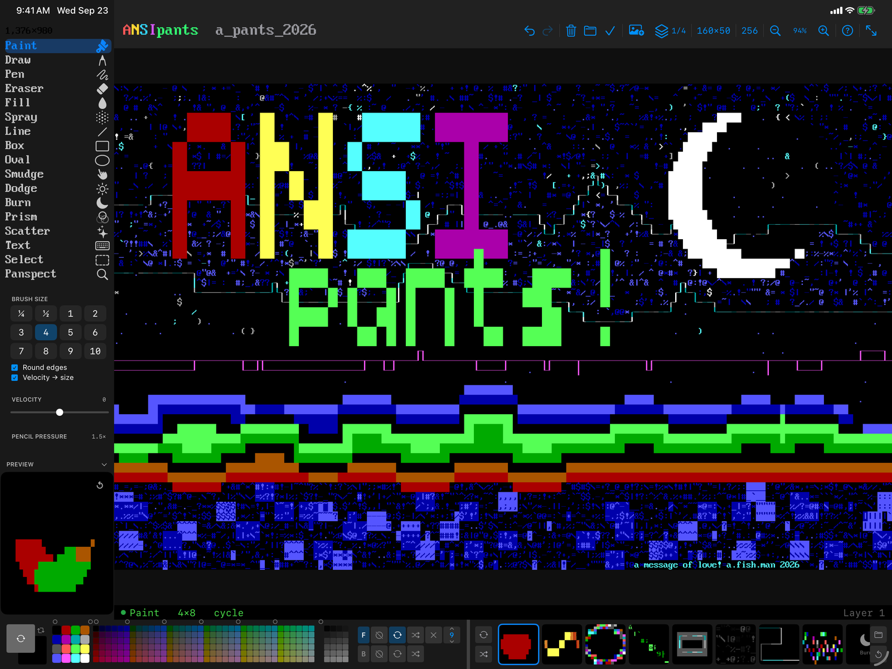
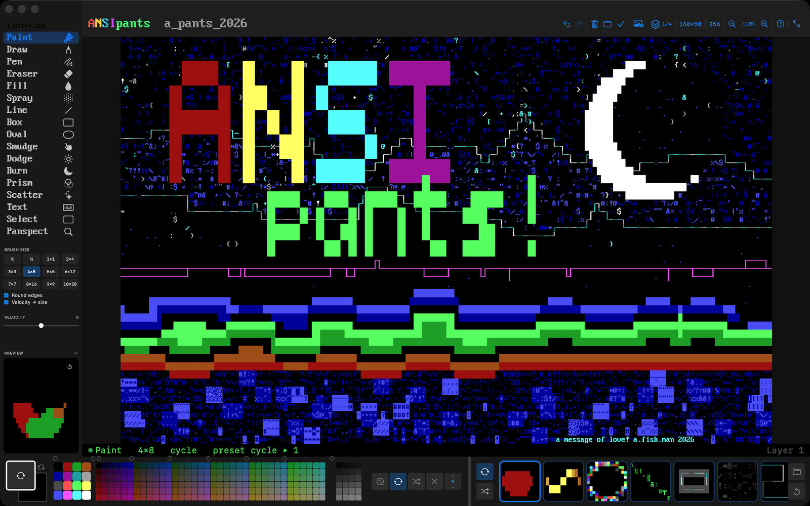
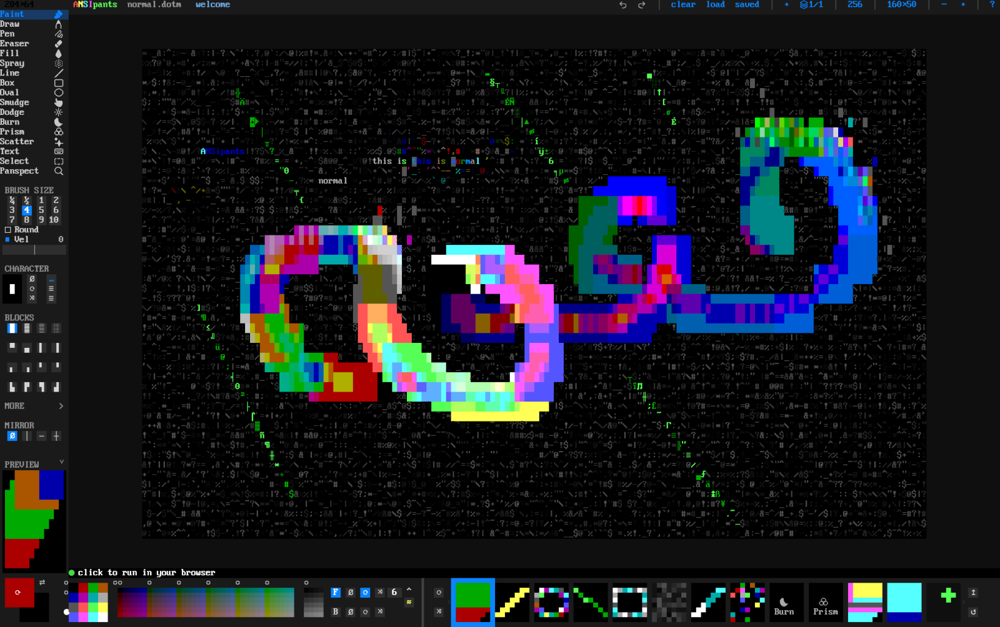
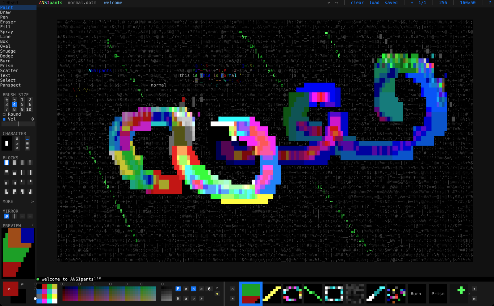
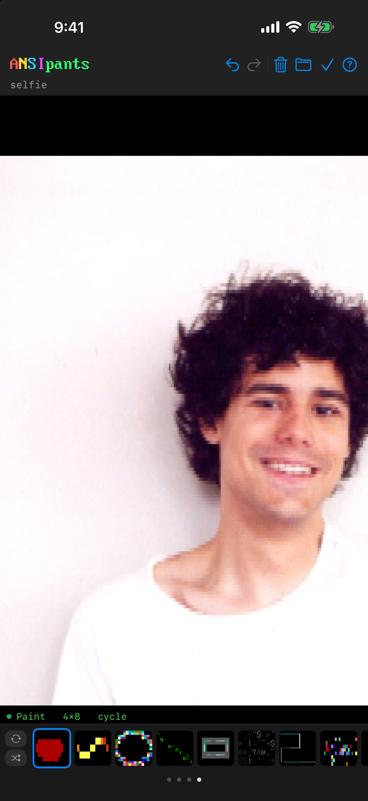

# ANSIpants

**Retro text art for the future.** An ANSI and ASCII art editor for iPad, iPhone and Mac, with free terminal editions for Linux and macOS, and a browser edition that runs offline.

<p align="center"></p>

> **There is no source code in this repository.** ANSIpants is closed source for now. This is its public home: releases of the terminal editions, the issue tracker, and the story. Everything else lives at **[ansipants.com](https://ansipants.com)**.
>
> Not related to `demozoo/ansipants` (a Python `.ans` to HTML converter) or `glhd/ansipants`. Same word, different things.

## The editions

| Edition | Runs on | Price |
|---|---|---|
| **ANSIpants** (the app) | iPhone, iPad and Mac, from the [App Store](https://apps.apple.com/app/id6776519476) | $5.99, one purchase for all three |
| **ANSIpants16M** | Terminal: Linux x86_64 and ARM64, macOS 12 and up | Free |
| **ANSIpants16** | Terminal, the limited edition: 16 colours, CP437, `.ANS` | Free |
| **Browser** | [ansipants.com/web](https://ansipants.com/web/) (16M) and [ansipants.com/16/web](https://ansipants.com/16/web/) | Free, works offline |

The same editor everywhere. Documents, presets and `.ANS` files move between all of them.

## Why a tablet

The desktop ANSI editors were built for a mouse and a keyboard, and none of them run on an iPad. ANSIpants was built the other way round: real drawing tools first, with Apple Pencil pressure and velocity, half-cell and quarter-cell brushes, smudge, dodge and burn, scatter and prism, on a canvas you pan and pinch. Then the same tools were brought to the Mac, to the terminal, and to the browser.

## What it does

- **Draw.** Paint, Draw, Pen, Eraser, Fill, Spray, Line, Box, Oval, Smudge, Dodge, Burn, Prism, Scatter, Text, Select and Panspect. Adaptive line width and stitch modes for diagonals. Box and oval thickness tuned to the 2:1 character cell. Brushes from a quarter of a cell to ten cells, rounded or square.
- **Colour.** Classic 16, 256 and 24-bit colour. Cycle and random pools per channel. A mono mode with phosphor tints. Reference-image sampling that respects the colour depth.
- **Text.** The full CP437 set, or all of Unicode in 16M. TDF and FIGlet fonts with a built-in browser, and your own font collections.
- **Layers, undo, presets.** Up to seven layers with offsets, deep undo, and tool presets that travel inside the document.
- **Files.** `.ANS` in and out, SAUCE and all. PNG export. `.ansipants` documents that open in every edition.
- **Terminal editions.** Static binaries, mouse and keyboard, the same sidebar and picker bar as the app. `anscat`, a tiny viewer for classic `.ans` files, ships alongside.

## Screenshots

| | |
|---|---|
|  |  |
|  |  |

## Terminal editions: download

Current: **ANSIpants16M 2.0.1 (35)** and **ANSIpants16 2.0.1 (33)**. The tarballs are attached to the [latest release](https://github.com/tungusk/ansipants/releases/latest) and served from [ansipants.com](https://ansipants.com/#download); the checksums are the same in both places.

**Linux**

```
tar -xzf ansipants16m-linux-*.tar.gz
./install.sh
ansipants
```

Fully static. Works on any distro, and under WSL on Windows.

**macOS**

```
xattr -d com.apple.quarantine ansipants16m-macos*.tar.gz
tar -xzf ansipants16m-macos*.tar.gz
./install.sh
ansipants
```

The `xattr` line clears Gatekeeper's quarantine. Or use System Settings → Privacy & Security → Open Anyway. Needs macOS 12 or later. The universal tarball also runs on Intel Macs.

## Formats

- **`.ANS`** — CP437 with ANSI colour, SAUCE record read and written. Opens in every edition and in every classic viewer.
- **`.ansipants`** — the editor's own document: layers, colour depth, reference image, and the preset bank. Plain JSON.
- **PNG** — rendered with the built-in VGA face, at true 2:1 cells.

## Source

Closed for now. Don't worry, we'll probably open the source some day; until then the author wants to keep control of where it goes. Bugs and ideas are welcome in the [issues](https://github.com/tungusk/ansipants/issues).

## Author

Arlo Fishman · [ansipants.com](https://ansipants.com) · [privacy policy](https://ansipants.com/privacy.html)

© 2026 Arlo Fishman. The screenshots in `media/` may be reused to write about ANSIpants.
